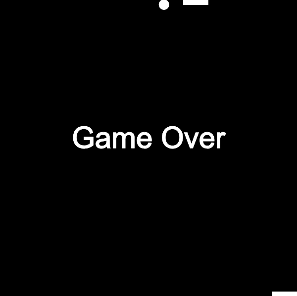
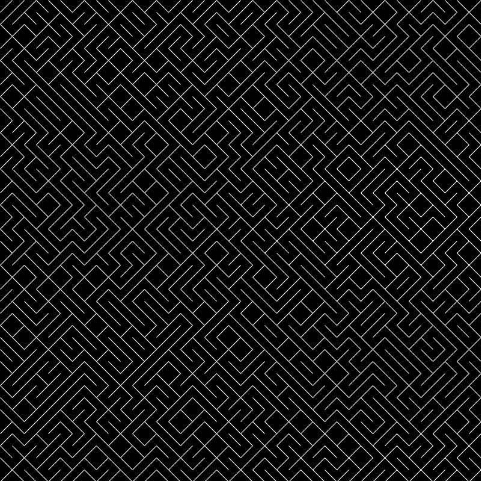
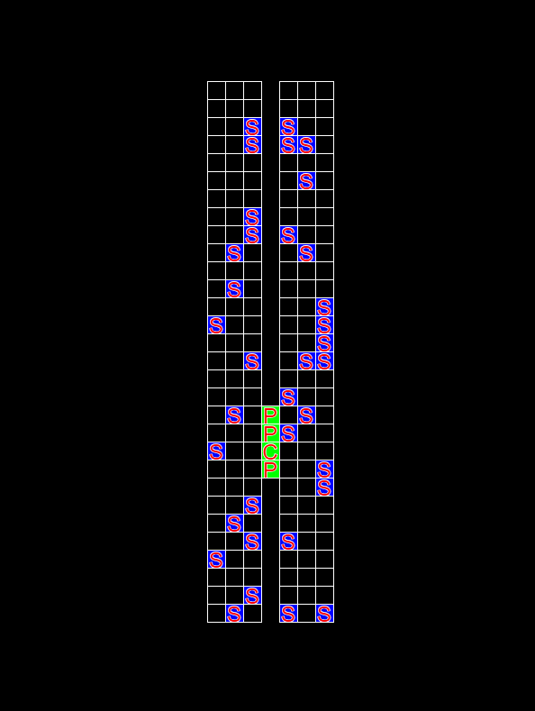
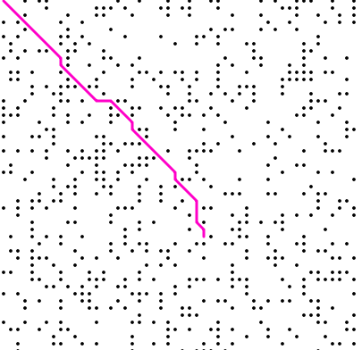
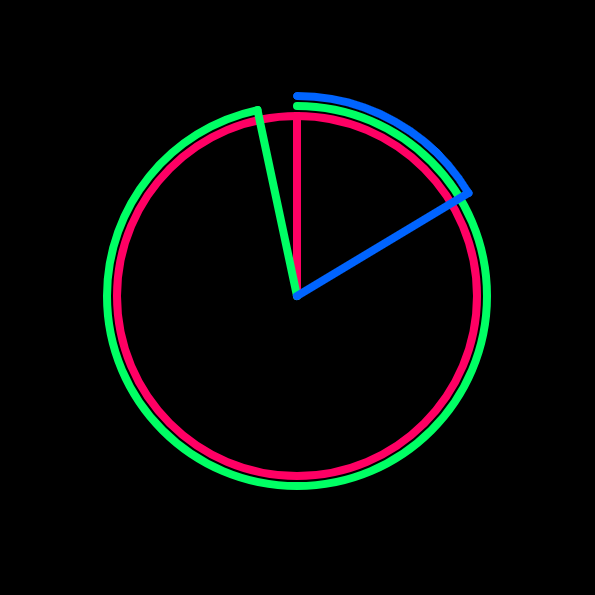
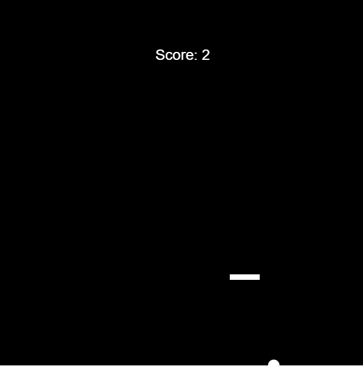
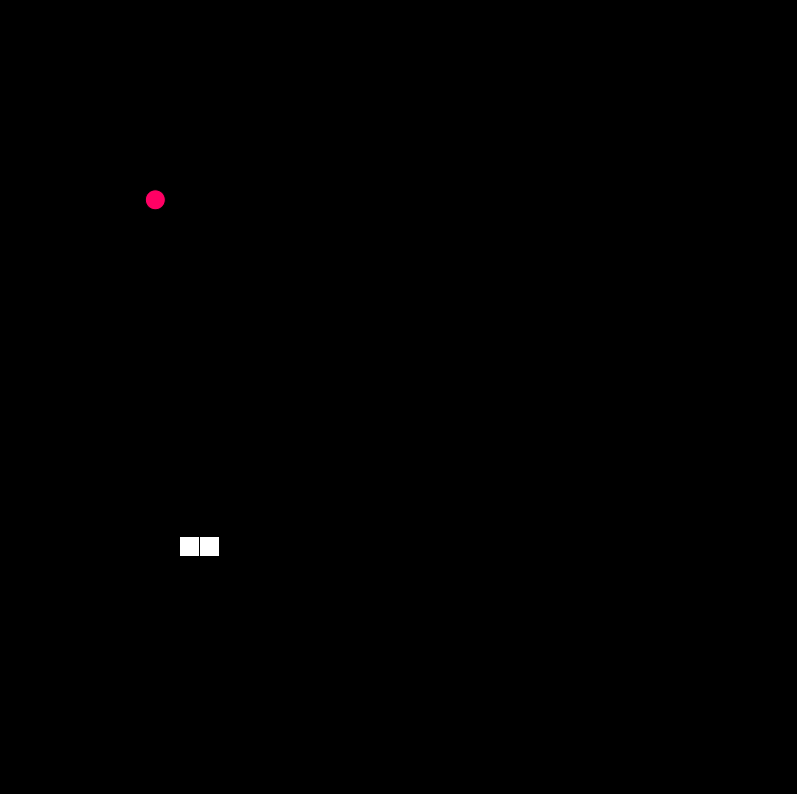
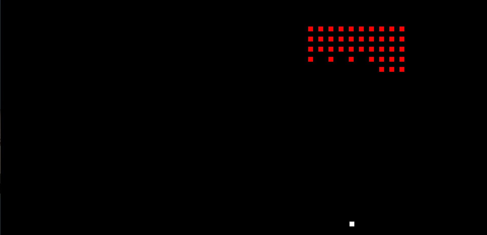
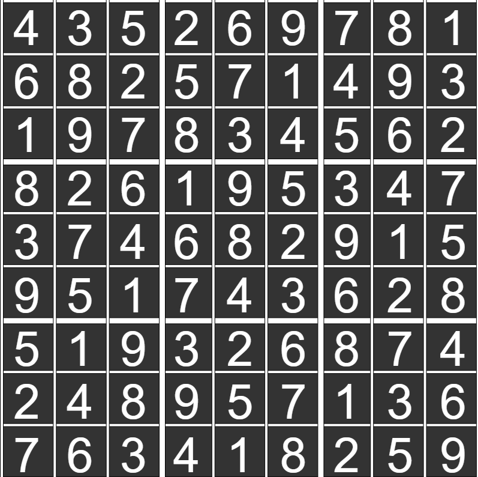
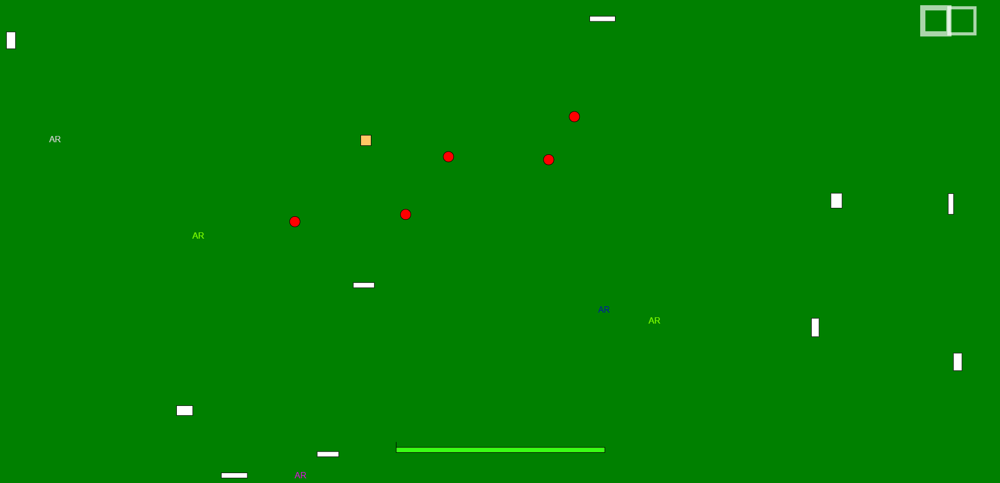

# p5-js
A collection of little projects written in javascript using the p5 library

# 2PlayerPong:
A 2 Player game (on the same machine) that simulates the infamous arcade game "Pong," but vertical instead of horizontal. 

# 10Print:
A recreation of the famous 10Print line in Basic language. Inspired by Daniel Shiffman's Coding Challenge #76.

# AirplaneBoardingSimulator:
A simulation of people boarding an airplane, with features such as carry-on luggage and waiting for the preceeding person to be seated. It can be modified to simulate different boarding techniques and orders, current it assigns each person a random seat.

# AStarPathfinding:
A visual representation of the A* Pathfinding algorithm. Inspired by Daniel Shiffman's Coding Challenge #51.

# Clock:
A unique visualization of an analog clock, available in 3 styles based on which part of the canvas was clicked on. Inspired by Daniel Shiffman's Coding Challenge #74.

# Pong:
A rendition of the popular arcade game "Bricks," but with no bricks. The goal is to keep the puck above the paddle.

# Snake:
A version of the popular arcade game "Snake."

# SpaceInvaders:
A version of popular arcade games such as  "Space Invaders" and "Galaga," where the goal is to shoot all of the moving aliens with your spaceship. Inspired by Daniel Shiffman's Coding Challenge #5.

# SudokuSolver:
A program that solves a given sudoku puzzle. Currently the sudoku puzzle must be hardcoded into the sketch.js file, but future extensions hold the option to dynamically input a sudoku puzzle.

# ZombieSurvival:
A zombie survival game where the player must move to avoid being attacked by the zombies and pick up weapons lying on the ground in an effort to exterminate all remaining zombies.

index.html:
The template for creating these scripts.
